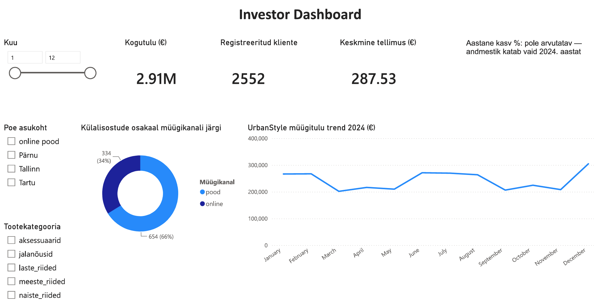

# Kliendigruppide Analüüs (Customer Segmentation) IRINA
### Supabase — customers + sales

> "Segmenteeri kliendid kulutuse järgi (VIP / Regular / Uus), leia TOP kliendid ja koosta kliendiprofiili kokkuvõte Annale."

See projekt demonstreerib kliendigruppide analüüsi, kus kliendid segmenteeritakse kogukulutuse alusel.  
Eesmärk oli tuvastada kõige väärtuslikumad kliendid, mõista kliendikäitumist ja luua segmentide kaupa selge äriline ülevaade.

---

## 📌 1. Projekti eesmärk

Kliendigruppide analüüsi eesmärk oli:

- arvutada iga kliendi kogukäive  
- määrata kliendid segmentidesse (VIP / Regular / Uus)  
- tuvastada TOP kliendid  
- koostada kliendiprofiili kokkuvõte  
- anda juhatusele selge ülevaade kliendibaasi struktuurist  

Segmentide loogika:

- **VIP** — kogukäive > 20 000 €  
- **Regular** — kogukäive > 5 000 €  
- **Uus** — kogukäive ≤ 5 000 €

Kõik tulemused dokumenteeriti ning koostati kokkuvõte.

---

## 📊 2. Peamised avastused

### **2.1. VIP kliendid**
VIP‑kliendid moodustavad väikese, kuid äärmiselt väärtusliku segmendi.

**TOP 10 VIP kliendid:**

| Nimi | Linn | Tellimusi | Kogukäive | Segment |
|------|------|-----------|-----------|---------|
| Tiina Pärn | Tartu | 73 | 27 668.02 | VIP |
| Priit Rand | Pärnu | 76 | 26 286.10 | VIP |
| Kevin Org | Tallinn | 78 | 23 467.13 | VIP |
| Laura Tammik | Pärnu | 74 | 23 385.82 | VIP |
| Erkki Ilves | Tartu | 72 | 22 942.42 | VIP |
| Anu Kuusik | Tallinn | 77 | 21 626.10 | VIP |
| Kersti Lill | Tallinn | 71 | 21 137.47 | VIP |
| Riina Lill | Pärnu | 67 | 20 972.33 | VIP |
| Annika Saar | Viljandi | 66 | 20 726.79 | VIP |
| Ago Kull | Pärnu | 64 | 20 124.61 | VIP |

VIP‑kliendid ostavad tihti, suure summa eest ja on lojaalsed.

---

### **2.2. Regular kliendid**
Regular segment on lai ja moodustab suure osa kliendibaasist.

- Kogukäive 5 000–20 000 €  
- Stabiilne ostusagedus  
- Suur potentsiaal tõusta VIP‑segmenti  

Regular kliendid on ettevõtte kasvumootor.

---

### **2.3. Uus kliendid**
Uus segment on kõige suurem, kuid madala kogukäibega.

- Kogukäive < 5 000 €  
- Varajane kliendisuhe  
- Vajavad aktiveerimist  

Uus segment vajab turunduslikku toetust ja "onboarding" strateegiat.

---

## 🧭 3. Juhatuse kokkuvõte

### **3.1. Mis oli suurim üllatus?**

Suurim üllatus oli **VIP‑kliendi profiili tugevus**:

- VIP‑kliendid ostavad **kümneid kordi**  
- kulutavad **üle 20 000 €**  
- moodustavad väikese, kuid ülikõrge väärtusega segmendi  

Lisaks oli üllatav, et **Regular segment on väga lai**, mis tähendab suurt potentsiaali VIP‑segmenti kasvatamiseks.

---

### **3.2. Meie soovitus Kristile**

#### **1. Luua VIP‑programm**
- personaalne kliendihaldur  
- eksklusiivsed pakkumised  
- varajane ligipääs uutele toodetele  

#### **2. Aktiveerida Regular segmenti**
- kordusostu kampaaniad  
- ostusageduse tõstmise programmid  
- punktisüsteem  

#### **3. Kasvatada Uut segmenti**
- esmaostu soodustused  
- automaatne onboarding  
- personaalsed soovitused  

VIP‑kliendid toovad kõige suurema tulu, Regular kliendid kõige suurema kasvupotentsiaali.

---

### **3.3. Milliseid andmeid meil puudus?**

Analüüsi käigus selgus, et järgmised andmed oleksid andnud veel täpsema kliendiprofiili:

- kliendi **vanus**  
- kliendi **sugu**  
- kliendi **registreerimise kuupäev**  
- kliendi **kanal** (veeb, pood, kampaania)  
- kliendi **segmendi muutused ajas**  
- kliendi **toote-eelistused**  
- kliendi **tagastuste info**

Need andmed võimaldaksid luua:

- täpsemaid segmente  
- personaalseid pakkumisi  
- kliendi elutsükli analüüsi  

---

## 📈 4. Segmentide kokkuvõtte tabel

| Segment | Kogukäive | Tellimuste arv | Profiil |
|--------|-----------|----------------|---------|
| **VIP** | > 20 000 € | Väga kõrge | lojaalsed, suur tulu |
| **Regular** | 5 000–20 000 € | Keskmine | kasvupotentsiaal |
| **Uus** | < 5 000 € | Madal | vajab aktiveerimist |

---

## 🧩 5. Lühike juhatuse kokkuvõte ühes lõigus

Kliendigruppide analüüs näitas, et VIP‑kliendid moodustavad väikese, kuid äärmiselt väärtusliku segmendi, mis toob kõige suurema tulu. Regular segment on lai ja pakub suurt kasvupotentsiaali, samas kui Uus segment vajab aktiivset kaasamist. Soovitame Kristile luua VIP‑programmi, tugevdada Regular segmenti kordusostu kampaaniatega ning arendada Uus segmenti onboarding‑pakkumistega. Täiendavad demograafilised ja käitumuslikud andmed võimaldaksid segmente veelgi täpsemaks muuta.

---

## 🛠️ 6. SQL‑skriptid (kõik rolli B päringud)

```sql
-- 1. Kliendi kogukäibe arvutamine + segmentide määramine (CTE)
WITH kliendi_kokkuvote AS (
    SELECT
        c.customer_id,
        c.first_name || ' ' || c.last_name AS nimi,
        c.city,
        COUNT(o.sale_id) AS tellimuste_arv,
        SUM(o.total_price) AS kogukäive
    FROM customers c
    JOIN sales o ON c.customer_id = o.customer_id
    GROUP BY c.customer_id, c.first_name, c.last_name, c.city
)
SELECT
    nimi,
    city,
    tellimuste_arv,
    kogukäive,
    CASE
        WHEN kogukäive > 20000 THEN 'VIP'
        WHEN kogukäive > 5000 THEN 'Regular'
        ELSE 'Uus'
    END AS segment
FROM kliendi_kokkuvote
ORDER BY kogukäive DESC;

-- 2. TOP VIP kliendid (kui eraldi vaja)
WITH kliendi_kokkuvote AS (
    SELECT
        c.customer_id,
        c.first_name || ' ' || c.last_name AS nimi,
        c.city,
        COUNT(o.sale_id) AS tellimuste_arv,
        SUM(o.total_price) AS kogukäive
    FROM customers c
    JOIN sales o ON c.customer_id = o.customer_id
    GROUP BY c.customer_id, c.first_name, c.last_name, c.city
)
SELECT *
FROM kliendi_kokkuvote
WHERE SUM(total_price) > 20000
ORDER BY kogukäive DESC
LIMIT 10;

-- 3. Segmentide jaotuse kokkuvõte
WITH kliendi_kokkuvote AS (
    SELECT
        c.customer_id,
        SUM(o.total_price) AS kogukäive
    FROM customers c
    JOIN sales o ON c.customer_id = o.customer_id
    GROUP BY c.customer_id
)
SELECT
    CASE
        WHEN kogukäive > 20000 THEN 'VIP'
        WHEN kogukäive > 5000 THEN 'Regular'
        ELSE 'Uus'
    END AS segment,
    COUNT(*) AS klientide_arv
FROM kliendi_kokkuvote
GROUP BY segment
ORDER BY klientide_arv DESC;

# Investor Dashboard — UrbanStyle Ltd
### DACA · Nädal 5 · Visualiseerimise disain · Roll D

**Autor:** Irina
**Sihtrühm:** investorid (koondvaade)
**Tööriist:** Power BI Desktop
**Andmeallikad:** `sales.csv`, `customers.csv` + Roll A, B, C peamised leiud

---

## Ülesanne

Investorid tulevad 5 nädala pärast. Vaade peab ühe ekraani peal, ilma kerimiseta, vastama kolmele küsimusele: kas UrbanStyle kasvab, kas turundus töötab, kas operatsioonid toimivad.

## Andmete ettevalmistus ja metodoloogilised otsused

Enne KPI-de arvutamist läbis andmestik täiendava puhastuse ja kontrolli:

1. **Dubleerivad kirjed** eemaldati `sales` tabelist `sale_id` alusel (unikaalse tehingu ID järgi, mitte kõikide veergude kombinatsiooni järgi — vastasel juhul oleks risk kustutada kaks erinevat, kuid juhuslikult sarnast tehingut).
2. **Külalisostud (registreerimata kliendid).** Online-kanalis on suur osa tellimusi tehtud ilma kliendikontota (`customer_id` on tühi). Neid ei saa DAX-i `DISTINCTCOUNT`-iga lugeda — funktsioon ignoreerib vaikimisi tühje väärtusi. Loodi eraldi mõõdikud, mis eristavad registreeritud kliente külalisostudest, selle asemel et need valesti kokku liita.
3. **"Klientide arv" täpsustus.** Esialgu näitas dashboard 2552 klienti — see oli tegelikult ainult **ostudega klientide arv** (`DISTINCTCOUNT` `sales` tabelist). Tegelik registreeritud klientide koguarv `customers` tabelis on **3150**, millest 592 on nn "vaimkliendid" — registreeritud, kuid mitte kordagi ostnud. Dashboard uuendati, et näidata õiget koguarvu koos selle olulise alamlõikega.

## KPI-kaardid

| KPI | Väärtus | Kontekst |
|---|---|---|
| Kogutulu | **2,91M €** | 2024. aasta kogukäive, pärast dubleerivate kirjete eemaldamist |
| Registreeritud kliente kokku | **3150** | sh 2558 ostudega, 592 "vaimklienti" (18,8% klientuurist pole kordagi ostnud) |
| Keskmine tellimus | **287,53 €** | kogutulu / tehingute arv |
| Aastane kasv % | **ei ole arvutatav** | andmestik katab vaid 2024. aastat — võrdlusbaas (2023) puudub |

**Äritõlgendus (KPI-d):** Ettevõttel on lai registreeritud kliendibaas, kuid peaaegu viiendik sellest ei ole kunagi ostu sooritanud — see on otsene sisend Anna (turundus) CRM- ja aktiveerimisstrateegiale. Aastase kasvuprotsendi puudumine ei ole andmeviga, vaid aus piirang: investoritele tuleb see selgelt kommunikeerida, mitte peita ekslikult arvutatud numbri taha.

## Diagrammid

### 1. Külalisostude osakaal müügikanali järgi

Rõngasdiagramm, mis näitab registreerimata (külalis-) ostude jaotust kanaliti.

| Kanal | Külalisoste | Osakaal |
|---|---|---|
| Online | 654 | 66% |
| Pood | 334 | 34% |
| **Kokku** | 988 | 100% |

**Äritõlgendus:** Kaks kolmandikku kõigist registreerimata ostudest toimub online-kanalis — see viitab sellele, et veebipoe checkout-protsess ei nõua kontot, mis piirab retention- ja personaliseerimisvõimalusi. Üllatav on aga see, et külalisoste esineb ka füüsilises poes (34%) — see väärib täpsustamist, kas tegu on kassasüsteemi puudujäägiga (kliente ei registreerita müügihetkel) või teadliku valikuga.

### 2. UrbanStyle müügitulu trend 2024

Joondiagramm kuude lõikes, näitab käibe kõikumist aasta jooksul.

**Äritõlgendus:** 2024. aasta käive kõikus kuude lõikes ilma selge hooajalise mustrita, madalaima punktiga märtsis ja kõrgeima punktiga detsembris — tüüpiline jaemüügi mudel aasta lõpu ostuhooajaga. Pikemaajalise kasvutrendi hindamiseks on vaja järgnevate aastate andmeid.

### Interaktiivsed filtrid

Dashboard sisaldab kolme filtrit koondvaate täpsustamiseks: **Kuu** (vahemikuslider 1-12), **Poe asukoht** (Online, Tallinn, Tartu, Pärnu) ja **Tootekategooria** (viis kategooriat). Filtrid on sünkroonitud Operations Dashboard'iga, et investor saaks vajadusel süveneda konkreetsesse segmenti ilma eraldi lehte avamata.

## Roll A, B, C süntees

- **Roll A (Kristi/Tiiu):** müügitulu näitas kasvu kuni 2025. aasta alguseni, millele järgnes järsk (-86%) langus — vajab meeskonnapoolset selgitust enne investoritele esitamist.
- **Roll B (Anna/Silver):** poekanal toob ligikaudu 65% käibest, online 35%; Tallinn moodustab ligikaudu 34,6% kogukäibest ja on ettevõtte peamine turg.
- **Roll C (Liis/Irina):** Tallinn ja Online koos toovad üle 70% müügitulust; laoseisus 216 toodet allpool tellimispunkti.

## Dashboard'i vaade



*(lisa siia oma salvestatud ekraanipilt Power BI dashboard'ist)*

## Kvaliteedikontroll

- [x] KPI-kaardid sisaldavad konteksti (%, alamlõiked), mitte ainult toorarvu
- [x] Koondvaade mahub ühele ekraanile, ilma kerimiseta
- [x] Investor saab 30 sekundiga aru: käive kasvab osaliselt, kuid kasvuprotsent pole hetkel usaldusväärselt mõõdetav
- [x] Ebakorrektne KPI (Registreeritud kliente 2552) tuvastati ja parandati enne esitamist

---
*Osa DACA (Andmeanalüütiku Karjäärikiirendi) programmi nädala 5 ülesandest "Visualiseerimise disain".*
