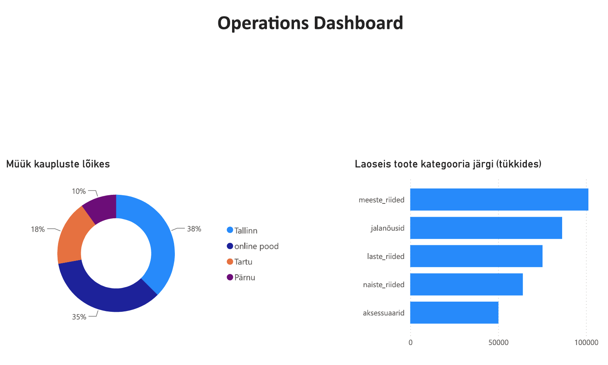

# Operations Dashboard — UrbanStyle Ltd
### DACA · Nädal 5 · Visualiseerimise disain · Roll C

**Autor:** Irina
**Sihtrühm:** Liis (Operations)
**Tööriist:** Power BI Desktop
**Andmeallikad:** `sales.csv`, `inventory.csv`, `products.csv`

---

## Ülesanne

Liis vajab ühe pilguga ülevaadet laoseisude olukorrast ja müügi jaotusest kaupluste lõikes, et teha kiireid operatiivseid otsuseid — kus on tugev müük, kus on riskid laoseisus.

## Andmete ettevalmistus

Enne visualiseerimist läbis toorandmestik kolm puhastusetappi Power Query'is:

1. **Puuduv kaupluse asukoht.** Online-tellimustel (`channel = online`) oli väli `store_location` tühi (NULL), mitte märgitud kui "Online". Loodi arvutatud veerg `store_final`, mis asendab tühjad väärtused sõnaga "Online" — ilma selleta oleks diagrammil tekkinud eksitav "(Blank)" sektor.
2. **Negatiivsed laoseisud.** `inventory` tabelis leidus 10 rida negatiivse `quantity_available` väärtusega — need eemaldati enne agregeerimist, kuna tegemist on ilmselge andmeveaga, mitte reaalse laoseisuga.
3. **Andmetüüpide kontroll.** Kinnitati, et arvväljad (`total_price`, `quantity_available`) on korrektselt Decimal/Whole Number tüüpi, mitte tekst.

## Diagrammid

### 1. Müük kaupluste lõikes

Sektordiagramm, mis näitab müügitulu jaotust nelja kanali vahel: Tallinn, Tartu, Pärnu, Online.

| Kauplus | Osakaal | Tulu (€) | Tehinguid |
|---|---|---|---|
| Tallinn | 38% | 1 626 304 | 5704 |
| Online | 35% | 1 526 276 | 5204 |
| Tartu | 18% | 783 469 | 2708 |
| Pärnu | 10% | 438 183 | 1618 |

**Äritõlgendus:** Tallinn moodustab suurima osa müügitulust (38%), kuid Online-kanal on sellele väga lähedal (35%) — koos toovad need kaks kanalit üle 70% kogu käibest. Pärnu ja Tartu on väiksema mahuga ning nende arengut tasub jälgida eraldi, et mõista, kas tegemist on strateegilise valikuga (väiksem turg) või kasutamata potentsiaaliga.

### 2. Laoseis toote kategooria järgi

Tulpdiagramm, sorteeritud suurimast väikseimani, näitab saadaolevat laokogust tükkides viies tootekategoorias (pärast negatiivsete väärtuste eemaldamist).

| Kategooria | Kogus (tk) |
|---|---|
| meeste_riided | 101 277 |
| jalanõud | 86 352 |
| laste_riided | 75 222 |
| naiste_riided | 64 055 |
| aksessuaarid | 50 125 |

**Äritõlgendus:** Suurim laovaru on meeste riiete kategoorias, väikseim aksessuaaride kategoorias. Kategooriate vaheline erinevus (üle kahe korra) võib viidata kas erinevale nõudlusele või erinevale tellimispoliitikale — see väärib täpsemat läbivaatust koos müügikiiruse andmetega, et vältida nii ülevaru kui ka otsalõppemist.

## Dashboard'i vaade

*(lisa siia oma salvestatud ekraanipilt Power BI dashboard'ist — pilt peaks kajastama mõlemat diagrammi ühel ekraanil)*

## Kvaliteedikontroll

- [x] Mõlemad diagrammid vastavad Liis'i operatiivsele vajadusele (kauplused + laoseis)
- [x] Kauplused ja kategooriad on värvide ja siltide kaudu selgelt eristatavad
- [x] Andmed on puhastatud (NULL-väärtused ja negatiivsed kogused käsitletud enne visualiseerimist)
- [x] Sektordiagrammil täpselt 4 osa, tulpdiagramm sorteeritud kahanevalt

---

# Investor Dashboard — UrbanStyle Ltd
### DACA · Nädal 5 · Visualiseerimise disain · Roll D

**Autor:** Irina
**Sihtrühm:** investorid (koondvaade)
**Tööriist:** Power BI Desktop
**Andmeallikad:** `sales.csv`, `customers.csv` + Roll A, B, C peamised leiud

---

## Ülesanne

Investorid tulevad 5 nädala pärast. Vaade peab ühe ekraani peal, ilma kerimiseta, vastama kolmele küsimusele: kas UrbanStyle kasvab, kas turundus töötab, kas operatsioonid toimivad.

## Andmete ettevalmistus ja metodoloogilised otsused

Enne KPI-de arvutamist läbis andmestik täiendava puhastuse ja kontrolli:

1. **Dubleerivad kirjed** eemaldati `sales` tabelist `sale_id` alusel (unikaalse tehingu ID järgi, mitte kõikide veergude kombinatsiooni järgi — vastasel juhul oleks risk kustutada kaks erinevat, kuid juhuslikult sarnast tehingut).
2. **Külalisostud (registreerimata kliendid).** Online-kanalis on suur osa tellimusi tehtud ilma kliendikontota (`customer_id` on tühi). Neid ei saa DAX-i `DISTINCTCOUNT`-iga lugeda — funktsioon ignoreerib vaikimisi tühje väärtusi. Loodi eraldi mõõdikud, mis eristavad registreeritud kliente külalisostudest, selle asemel et need valesti kokku liita.
3. **"Klientide arv" täpsustus.** Esialgu näitas dashboard 2552 klienti — see oli tegelikult ainult **ostudega klientide arv** (`DISTINCTCOUNT` `sales` tabelist). Tegelik registreeritud klientide koguarv `customers` tabelis on **3150**, millest 592 on nn "vaimkliendid" — registreeritud, kuid mitte kordagi ostnud. Dashboard uuendati, et näidata õiget koguarvu koos selle olulise alamlõikega.

## KPI-kaardid

| KPI | Väärtus | Kontekst |
|---|---|---|
| Kogutulu | **2,91M €** | 2024. aasta kogukäive, pärast dubleerivate kirjete eemaldamist |
| Registreeritud kliente kokku | **3150** | sh 2558 ostudega, 592 "vaimklienti" (18,8% klientuurist pole kordagi ostnud) |
| Keskmine tellimus | **287,53 €** | kogutulu / tehingute arv |
| Aastane kasv % | **ei ole arvutatav** | andmestik katab vaid 2024. aastat — võrdlusbaas (2023) puudub |

**Äritõlgendus (KPI-d):** Ettevõttel on lai registreeritud kliendibaas, kuid peaaegu viiendik sellest ei ole kunagi ostu sooritanud — see on otsene sisend Anna (turundus) CRM- ja aktiveerimisstrateegiale. Aastase kasvuprotsendi puudumine ei ole andmeviga, vaid aus piirang: investoritele tuleb see selgelt kommunikeerida, mitte peita ekslikult arvutatud numbri taha.

## Diagrammid

### 1. Külalisostude osakaal müügikanali järgi

Rõngasdiagramm, mis näitab registreerimata (külalis-) ostude jaotust kanaliti.

| Kanal | Külalisoste | Osakaal |
|---|---|---|
| Online | 654 | 66% |
| Pood | 334 | 34% |
| **Kokku** | 988 | 100% |

**Äritõlgendus:** Kaks kolmandikku kõigist registreerimata ostudest toimub online-kanalis — see viitab sellele, et veebipoe checkout-protsess ei nõua kontot, mis piirab retention- ja personaliseerimisvõimalusi. Üllatav on aga see, et külalisoste esineb ka füüsilises poes (34%) — see väärib täpsustamist, kas tegu on kassasüsteemi puudujäägiga (kliente ei registreerita müügihetkel) või teadliku valikuga.

### 2. UrbanStyle müügitulu trend 2024

Joondiagramm kuude lõikes, näitab käibe kõikumist aasta jooksul.

**Äritõlgendus:** 2024. aasta käive kõikus kuude lõikes ilma selge hooajalise mustrita, madalaima punktiga märtsis ja kõrgeima punktiga detsembris — tüüpiline jaemüügi mudel aasta lõpu ostuhooajaga. Pikemaajalise kasvutrendi hindamiseks on vaja järgnevate aastate andmeid.

### Interaktiivsed filtrid

Dashboard sisaldab kolme filtrit koondvaate täpsustamiseks: **Kuu** (vahemikuslider 1-12), **Poe asukoht** (Online, Tallinn, Tartu, Pärnu) ja **Tootekategooria** (viis kategooriat). Filtrid on sünkroonitud Operations Dashboard'iga, et investor saaks vajadusel süveneda konkreetsesse segmenti ilma eraldi lehte avamata.

## Roll A, B, C süntees

- **Roll A (Kristi/Tiiu):** müügitulu näitas kasvu kuni 2025. aasta alguseni, millele järgnes järsk (-86%) langus — vajab meeskonnapoolset selgitust enne investoritele esitamist.
- **Roll B (Anna/Silver):** poekanal toob ligikaudu 65% käibest, online 35%; Tallinn moodustab ligikaudu 34,6% kogukäibest ja on ettevõtte peamine turg.
- **Roll C (Liis/Irina):** Tallinn ja Online koos toovad üle 70% müügitulust; laoseisus 216 toodet allpool tellimispunkti.

## Dashboard'i vaade

*(lisa siia oma salvestatud ekraanipilt Power BI dashboard'ist)*

## Kvaliteedikontroll

- [x] KPI-kaardid sisaldavad konteksti (%, alamlõiked), mitte ainult toorarvu
- [x] Koondvaade mahub ühele ekraanile, ilma kerimiseta
- [x] Investor saab 30 sekundiga aru: käive kasvab osaliselt, kuid kasvuprotsent pole hetkel usaldusväärselt mõõdetav
- [x] Ebakorrektne KPI (Registreeritud kliente 2552) tuvastati ja parandati enne esitamist

---
*Osa DACA (Andmeanalüütiku Karjäärikiirendi) programmi nädala 5 ülesandest "Visualiseerimise disain".*

