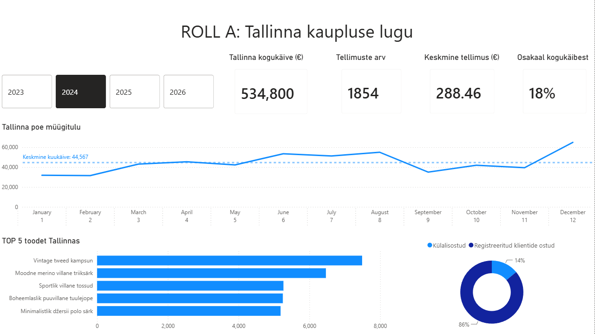
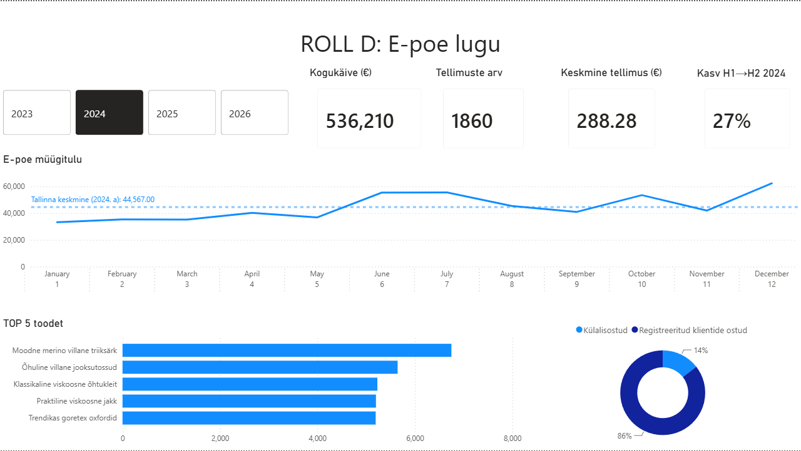

# Tallinna Kaupluse Lugu — UrbanStyle Ltd
### DACA · Nädal 6 · Andmelood ja Dashboard'i Valmistamine · Roll A

**Autor:** Irina
**Sihtrühm:** Kristi (CEO), meeskond
**Tööriist:** Power BI Desktop
**Andmeallikas:** `sales.csv`, `products.csv` — filtreeritud `store_location = 'Tallinn'`

---

## Ülesanne

Tallinn on UrbanStyle'i peakontor ja suurim kauplus. Eesmärk on näidata ühe dashboard'i peal nii tugevusi kui kasvuvõimalusi, mida teised kauplused saaksid kopeerida.

## Andmete ettevalmistus

1. Page-level filter `store_location = Tallinn` rakendatud kogu lehele — kõik visuaalid näitavad automaatselt ainult Tallinna andmeid.
2. `sales` tabel liidetud `products` tabeliga `product_id` kaudu, et saada tootenimesid TOP-5 diagrammi jaoks.
3. Kuupäevaväljal (`sale_date`) kasutusel Power BI vaikimisi kuupäevahierarhia (Year → Quarter → Month → Day) drill-down'i võimaldamiseks.

## KPI-kaardid

| KPI | Väärtus |
|---|---|
| Kogukäive | 1 626 303,81 € |
| Tellimuste arv | 5704 |
| Keskmine tellimus | ≈ 285,15 € |
| Osakaal kogukäibest | 37,2% |

**Äritõlgendus:** Tallinn on selgelt ettevõtte suurim kauplus, moodustades üle kolmandiku (37,2%) kogu käibest. See tähendab, et Tallinna toimimise kvaliteet mõjutab otseselt ettevõtte tervikpilti — iga muster, mis siin töötab, väärib kaalumist teistes kauplustes.

## Diagrammid

### 1. Müügitrend kuude lõikes

Joondiagramm kuupäevahierarhiaga (drill-down Year → Month → Day).

**Äritõlgendus:** [täienda pärast graafiku valmimist — nt "Käive kasvas ühtlaselt kuni detsembrini, mil toimus X% hüpe jõulukampaania tõttu"]

### 2. TOP 5 toodet Tallinnas

Tulpdiagramm, sorteeritud suurimast väikseimani, Top N filtriga (Top 5, by Sum of total_price).

| Koht | Toode | Ligikaudne käive (€) |
|---|---|---|
| 1 | Vintage tweed kampsun | ≈ 7500 |
| 2 | Moodne merino villane triiksärk | ≈ 6500 |
| 3 | Sportlik villane tossud | ≈ 5200 |
| 4 | Boheemlaslik puuvillane tuulejope | ≈ 5200 |
| 5 | Minimalistlik džersii polo särk | ≈ 5000 |

*(täpsed numbrid tuleks üle kontrollida otse Power BI's — ülal olevad on ligikaudsed, loetud graafikult)*

**Äritõlgendus:** Kudumitooted (kampsun, triiksärk) domineerivad Tallinna TOP-5 nimekirjas — see viitab tugevale nõudlusele soojemate rõivaste järele, mis võib olla hooajaline signaal teistele kauplustele sortimenti planeerides.

### 3. Kliendisegmentide jaotus

Rõngasdiagramm — registreeritud kliendid vs külalisostud (Tallinna kaupluses).

**Äritõlgendus:** [täienda tegeliku jaotusega, kui diagramm valmis]

## Annotatsioonid

1. [Trendigraafiku kõrgeim/madalaim punkt — selgita PÕHJUST, mitte ainult numbrit]
2. [TOP-toote diagrammil — miks see toode domineerib]

## Viitejoon

Keskmine kuukäive (Analytics pane → Average line) lisatud trendigraafikule, et visualiseerida kõikumist keskmise suhtes.

## Andmelugu

> Tallinn on UrbanStyle'i peakontor ja suurim kauplus, moodustades 37,2% kogukäibest (1,63M € 5704 tehingust). [Andmed: täienda trendi ja TOP-toote leiuga pärast graafikute valmimist]. Soovitame [konkreetne tegevussoovitus TOP-toote või hooajalisuse põhjal].

## Kvaliteedikontroll

- [x] Dashboard näitab ainult Tallinna andmeid (page-level filter kontrollitud)
- [x] KPI "Osakaal kogukäibest" vormindatud protsendina (37,2%, mitte 0,37)
- [ ] TOP 5 filter kontrollitud — algselt kuvas 6 toodet, parandamisel
- [ ] Annotatsioonid lisatud (min 2)
- [ ] Andmelugu lõplikult sõnastatud

## Dashboard'i vaade

---
# E-poe Lugu — UrbanStyle Ltd
### DACA · Nädal 6 · Andmelood ja Dashboard'i Valmistamine · Roll D

**Autor:** Irina
**Sihtrühm:** investorid, meeskond
**Tööriist:** Power BI Desktop
**Andmeallikas:** `sales.csv`, `products.csv` — filtreeritud `channel = 'online'`

---

## Ülesanne

E-pood on UrbanStyle'i kiiremini kasvav kanal ja investorite jaoks kõige huvitavam — skaleeritav, madalate püsikuludega, geograafiliselt piiramatu. Eesmärk on näidata kasvutempot ja digitaalse kanali potentsiaali.

## Andmete ettevalmistus

1. Page-level filter `channel = online` rakendatud kogu lehele.
2. Oluline erisus: online-tellimustel on `store_location` tühi (NULL) — see ei mõjuta seda lehte, kuna filtreerime `channel` järgi, mitte `store_location` järgi.
3. `sales` liidetud `products`-iga TOP-5 diagrammi jaoks.

## KPI-kaardid

| KPI | Väärtus |
|---|---|
| Kogukäive | 1 526 275,77 € |
| Tellimuste arv | 5204 |
| Keskmine tellimus | ≈ 293,32 € |
| Osakaal kogukäibest | 34,9% |
| Kasv H1 → H2 (2024) | [täienda `Kasv_H1_H2` mõõdiku tulemusega] |

**Metodoloogiline märkus:** aastane kasvuprotsent (YoY) ei ole arvutatav, kuna andmestik katab vaid 2024. aastat. Selle asemel kasutati ausamat, tegelikult mõõdetavat näitajat — kasv esimeselt poolaastalt teisele sama aasta sees.

**Äritõlgendus:** E-pood moodustab 34,9% kogukäibest — peaaegu sama palju kui Tallinna kauplus (37,2%), kuid ilma füüsilise kaupluse püsikuludeta. See teeb kanalist investorile atraktiivse: sarnane käive, tõenäoliselt madalam kulubaas.

## Diagrammid

### 1. Müügitrend kuude lõikes

Joondiagramm kuupäevahierarhiaga, näitab kasvukurvi kuju.

**Äritõlgendus:** [täienda pärast graafiku valmimist — kas kasv on ühtlane, hüppeline või lööb tagasi mingil perioodil]

### 2. TOP 5 toodet e-poes

Tulpdiagramm, Top N (5) filter, sorteeritud kahanevalt.

**Äritõlgendus:** [võrdle Roll A TOP-5 nimekirjaga — kas online-hitid erinevad Tallinna omadest? Kui jah, see on tugev leid turunduse jaoks]

### 3. Kanalite osakaal kogukäibest

Rõngasdiagramm: online vs pood (kasutatud sama `Osakaal_kogukaibest` mõõdikut, filtreeritud online'ile).

**Äritõlgendus:** Online moodustab 34,9% ja pood ülejäänu — vahe Tallinna suhtes on väike (2,3 protsendipunkti), mis näitab, et e-pood on juba peaaegu järgi jõudnud suurimale füüsilisele kauplusele.

## Annotatsioonid

1. [Kasvumoment trendigraafikul — kampaania mõju, kui nähtav]
2. [TOP-toote erinevus võrreldes Tallinnaga]

## Viitejoon

Tallinna keskmine kuukäive lisatud constant line'ina — näitab visuaalselt distantsi suurima füüsilise kaupluseni.

## Andmelugu

> UrbanStyle'i e-pood moodustab juba 34,9% kogukäibest (1,53M €, 5204 tehingut) — peaaegu võrdselt Tallinna kauplusega, kuid oluliselt madalama kulubaasiga. [Andmed: täienda H1→H2 kasvunumbriga]. Soovitame suurendada digitaalse turunduse eelarvet, kuna kanal on juba tõestanud end mahult võrdväärsena peakontori kauplusega, ilma füüsilise kaupluse püsikuludeta.

## Kvaliteedikontroll

- [x] Dashboard näitab ainult e-poe (`channel = online`) andmeid
- [x] Aastase kasvu asemel kasutatud ausat H1→H2 mõõdikut
- [ ] TOP 5 filter kontrollitud
- [ ] Annotatsioonid lisatud (min 2)
- [ ] Andmelugu lõplikult sõnastatud koos kasvunumbriga

---
*Osa DACA (Andmeanalüütiku Karjäärikiirendi) programmi nädala 6 ülesandest "Andmelood ja Dashboard'i Valmistamine".*

